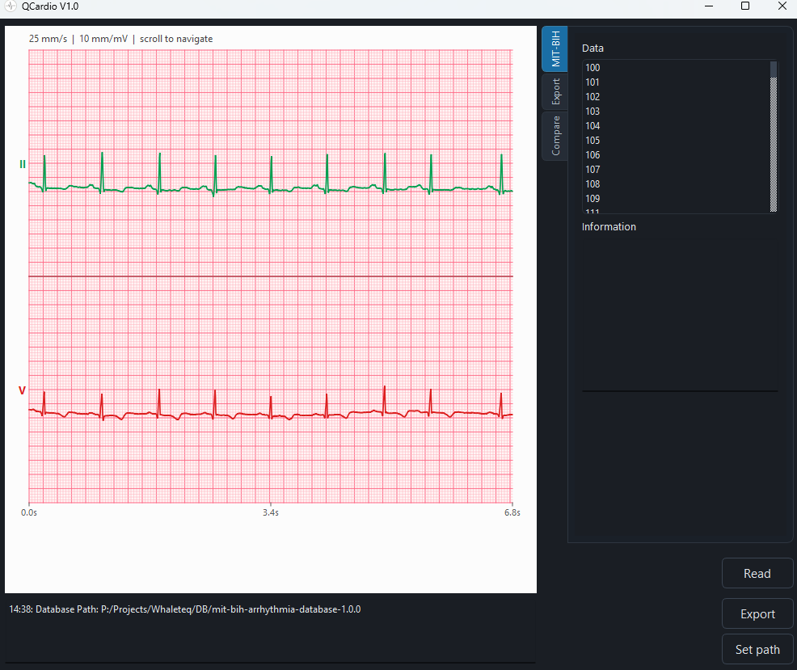
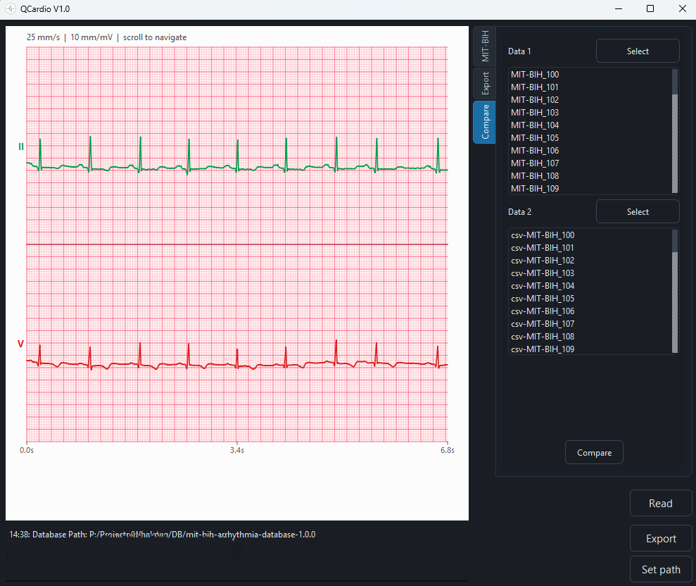

# PhysioNet ECG Signal Viewer

This guide covers running QCardio to view PhysioNet ECG records from a local WFDB database and to compare CSV annotation files.

## Prerequisites

- PhysioNet [MIT-BIH](https://physionet.org/content/mitdb/1.0.0/) database (or another WFDB-format set such as converted AHA).
- A QCardio build or release.

## View records

1. Install the application and keep the database on disk.
2. On the first page, set the database path (directory that contains `.hea` files).
3. Select a record and press **Read**.

## Export

Choose RC7 or raw samples, an output folder, and **Export**. Enable export-all to process every record in the list; the footer progress bar updates as files complete.

## Compare CSV files

1. Open the compare tab.
2. Select the **reference** CSV folder, then the **algorithm** CSV folder. Both folders must have the same number of `.csv` files.
3. Press **Compare** and pick a folder for `Report.csv`.
4. The footer shows `Compare current/total` until the job finishes. Buttons stay disabled during the run.
