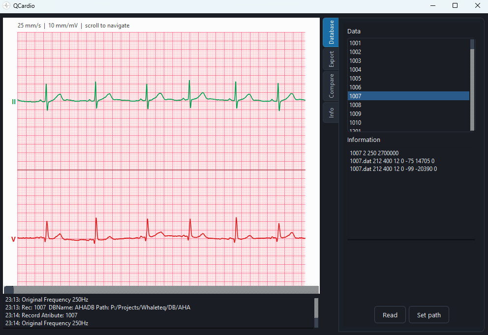
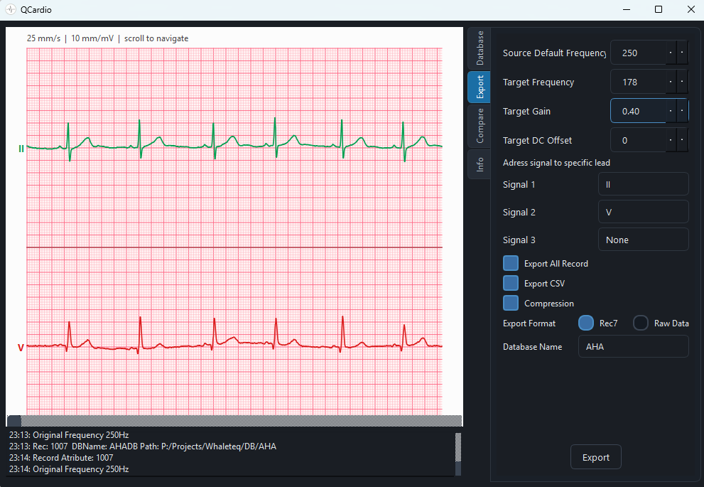
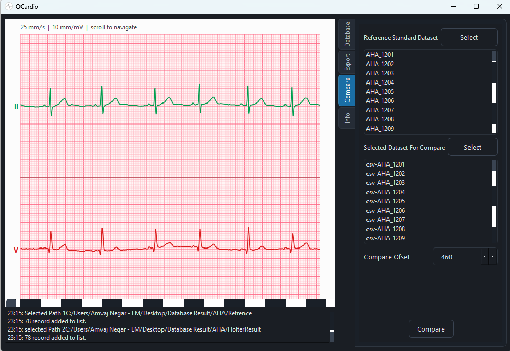

# Sample walkthrough

QCardio 1.0.0 reads a local WFDB database, exports records, and compares beat CSV files. This page is the short path through those screens. Field-by-field behavior, file names, and report columns are in the [user guide](../docs/user-guide.md).

## What you need

- A QCardio 1.0.0 build. See [build instructions](../docs/build.md).
- A WFDB database on disk, such as the PhysioNet [MIT-BIH Arrhythmia Database](https://physionet.org/content/mitdb/1.0.0/), or an AHA set converted with [scripts/README.md](../scripts/README.md).

The database directory is the folder that contains the `.hea` files.

## View a record

1. On the **Database** tab, set the database path.
2. Select a record.
3. Click **Read**.

## Export

On the **Export** tab, set the source and target frequency, gain, and DC offset. Choose **Raw Data** or **Rec7**, choose the database name, and click **Export**.

Leave **Export CSV** checked to write `DatabaseName_record.csv` beside the signal file. Check **Export All Record** to export every header in the list. The footer progress bar advances until the job finishes.

Raw output is `DatabaseName_record.bin`. Rec7 output is `DatabaseName_record.rc7`.

## Compare

1. Open the **Compare** tab.
2. Select the reference CSV folder, then the algorithm CSV folder. Both folders must contain the same number of `.csv` files, listed in the same order.
3. Set **Compare Ofset** when the first beats should be excluded from the scores. Choosing **AHA** as the database name sets this to 460. Choosing **ESC** or **CU** sets it to 4.
4. Click **Compare**.

QCardio creates a `Compare` folder next to the parent of the algorithm directory and writes:

- `Report.csv` — beat counts, sensitivity, and positive predictive value
- `Report.csva.csv` — missed beats and shutdown time
- `Report.csvb.csv` — true and false counts, plus a summary row
- one `referenceVSalgorithm.csv` alignment file per pair

The footer shows `Compare current/total` until the run finishes. Read, Export, and Compare stay disabled during the run.

Column definitions and the 1.0.0 summary-row notes are in the [user guide](../docs/user-guide.md#report-files).
